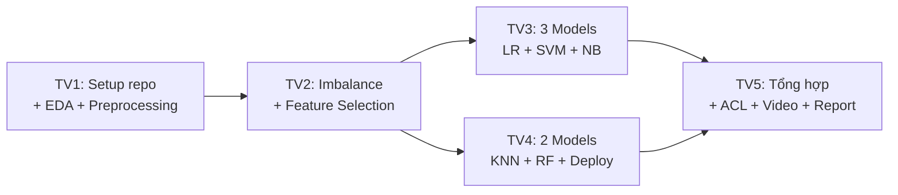

# 📋 Phân Công Lab 6 - Bảo Mật Thông Tin (Nhóm 5 người)

## 📁 Phân Tích Thư Mục Lab 6

| # | Tài liệu | Loại | Vai trò |
|---|----------|------|---------|
| 1 | `1.Wazuh-SOC-Lab/` | Thư mục repo GitHub | ⚠️ **CHỈ THAM KHẢO** - Đây là repo mẫu hướng dẫn triển khai SOC Lab với Wazuh, Suricata, pfSense. Không yêu cầu nộp bài. |
| 2 | `2. Real-time Network IDS using ML.pdf` | Bài Lab chính | ✅ **BÀI NỘP** - Yêu cầu xây dựng hệ thống IDS thời gian thực dùng ML |
| 3 | `3.Configuring Standard ACLs.pka` | Bài Lab chính | ✅ **BÀI NỘP** - Cấu hình ACL chuẩn trên Packet Tracer |

> [!IMPORTANT]
> **Wazuh-SOC-Lab** chỉ là tài liệu tham khảo (repo GitHub của người khác), KHÔNG cần phân công làm bài này.
> Chỉ cần tập trung vào **2 bài chính**: IDS Machine Learning và ACL Packet Tracer.

---

## 🎯 Tổng Quan 2 Bài Chính

### Bài 1: Real-time Network IDS using Machine Learning (Nặng - ~70% công việc)
- Xây dựng hệ thống phát hiện xâm nhập mạng thời gian thực
- Dataset: CIC-IDS2017 (79 features, nhiều loại tấn công)
- Triển khai 5 mô hình ML: Logistic Regression, SVM, Naive Bayes, KNN, Random Forest
- Deploy mô hình tốt nhất (Random Forest) cho real-time alert
- **Nộp**: GitHub repo, source code (.ipynb/.py), README.md, model (.pkl), alerts.log

### Bài 2: Configuring Standard ACLs - Packet Tracer (~30% công việc)
- Cấu hình ACL trên router R2 và R3
- Kiểm tra connectivity, verify ACL
- **Nộp**: File .pka hoàn thành + demo video

---

## 👥 PHÂN CÔNG CHI TIẾT CHO 5 THÀNH VIÊN

### 👤 Thành viên 1 — Team Lead + EDA & Data Preprocessing
**Phụ trách:** Khởi tạo project + Phân tích dữ liệu + Tiền xử lý

| Công việc | Chi tiết |
|-----------|----------|
| Tạo GitHub repo | Tên: `Network-Intrusion-Detection-ML`, setup `.gitignore`, branches |
| Merge Data | Load 8 file CSV của CIC-IDS2017, concat thành 1 DataFrame |
| Data Cleaning | Xử lý whitespace, inf, NaN (thay bằng median), drop zero-variance & duplicates |
| Memory Optimization | Downcast data types (int64→uint8/int16, float64→float32) |
| EDA | Plot phân bố attack types + Correlation Heatmap |

> [!TIP]
> Đây là người khởi tạo repo và làm nền tảng dữ liệu cho cả nhóm sử dụng.

---

### 👤 Thành viên 2 — Class Imbalance + Feature Selection
**Phụ trách:** Xử lý mất cân bằng dữ liệu + Chọn đặc trưng

| Công việc | Chi tiết |
|-----------|----------|
| Label Encoding | Dùng `LabelEncoder` chuyển cột Label |
| Feature Scaling | Dùng `StandardScaler` chuẩn hóa features |
| SMOTE | Over-sample minority classes (threshold ~10% majority class) |
| RandomUnderSampler | Giảm samples BENIGN để tránh bias |
| Feature Selection | Lọc 18 core features: Protocol, Flow Duration, Tot Fwd Pkts, Tot Bwd Pkts, TotLen Fwd Pkts, TotLen Bwd Pkts, Fwd Pkt Len Mean, Bwd Pkt Len Mean, Flow Byts/s, Flow Pkts/s, Pkt Len Mean, Pkt Len Std, SYN/ACK/FIN/RST/PSH/URG Flag Cnt |
| Train/Test Split | Chia dữ liệu train-test cho cả nhóm |

---

### 👤 Thành viên 3 — Model Training (Logistic Regression + SVM + Naive Bayes)
**Phụ trách:** Triển khai & đánh giá 3 mô hình đầu tiên

| Công việc | Chi tiết |
|-----------|----------|
| Logistic Regression | Train + `classification_report` + Confusion Matrix |
| SVM | Train + `classification_report` + Confusion Matrix |
| Naive Bayes | Train + `classification_report` + Confusion Matrix |
| So sánh | Bảng so sánh Accuracy, Precision, Recall, F1-score |
| Phân tích | Nhận xét Recall cho attack classes (cyber context) |

---

### 👤 Thành viên 4 — Model Training (KNN + Random Forest) + Deployment
**Phụ trách:** Triển khai mô hình còn lại + Deploy real-time

| Công việc | Chi tiết |
|-----------|----------|
| KNN | Train + `classification_report` + Confusion Matrix |
| Random Forest | Train + `classification_report` + Confusion Matrix |
| So sánh tổng hợp | Tổng hợp bảng so sánh 5 mô hình |
| Save Model | Export Random Forest dưới dạng `.pkl` (joblib/pickle) |
| Real-time Simulation | Viết function simulate receiving single network flow |
| Alert Generation | Nếu predict ≠ BENIGN → Generate Suricata-style alert |
| alerts.log | Ghi log: `[ALERT] Suspicious traffic detected: DDoS. Destination Port: 80.` |

> [!IMPORTANT]
> Đây là phần quan trọng nhất — Real-time deployment là yêu cầu cuối cùng của bài lab.

---

### 👤 Thành viên 5 — ACL Packet Tracer + README & Utilities (GitHub) + Video + Báo cáo
**Phụ trách:** Bài ACL + Commit code lên GitHub repo + Video + Báo cáo

#### 🖥️ Phần code commit lên GitHub repo:

| Công việc | Chi tiết |
|-----------|----------|
| **README.md** | Viết README chuyên nghiệp: Project Introduction, Installation Guide, Usage Instructions, bảng so sánh 5 models, kiến trúc hệ thống |
| **requirements.txt** | Liệt kê tất cả dependencies (scikit-learn, pandas, numpy, imbalanced-learn, joblib, matplotlib, seaborn...) |
| **Utility functions** | Viết file `utils.py`: hàm load data, hàm plot confusion matrix, hàm format alert log |
| **Tổng hợp kết quả** | Viết notebook/script tổng hợp bảng comparison 5 models (accuracy, precision, recall, F1) + visualization |
| **Config & Setup** | File `config.py` chứa paths, selected_features, hyperparameters |

#### 🔧 Phần ACL Packet Tracer:

| Công việc | Chi tiết |
|-----------|----------|
| **Part 1: Plan ACL** | Kiểm tra full connectivity (ping tất cả thiết bị) |
| **Part 2: ACL trên R2** | `access-list 1 deny 192.168.11.0 0.0.0.255` → `access-list 1 permit any` → Apply `ip access-group 1 out` trên GigabitEthernet0/0 |
| **Part 2: ACL trên R3** | `access-list 1 deny 192.168.10.0 0.0.0.255` → `access-list 1 permit any` → Apply `ip access-group 1 out` trên GigabitEthernet0/0 |
| **Verify** | Chạy `show access-list`, `show run`, `show ip interface gig0/0` |
| **Test Connectivity** | ✅ 192.168.10.10 → 192.168.11.10 (pass) |
| | ✅ 192.168.10.10 → 192.168.20.254 (pass) |
| | ❌ 192.168.11.10 → 192.168.20.254 (fail) |
| | ❌ 192.168.10.10 → 192.168.30.10 (fail) |
| | ✅ 192.168.11.10 → 192.168.30.10 (pass) |
| | ✅ 192.168.30.10 → 192.168.20.254 (pass) |

#### 📹 Phần video + báo cáo:

| Công việc | Chi tiết |
|-----------|----------|
| **Quay video** | Demo cả 2 bài (IDS + ACL), format .mp4 |
| **Viết báo cáo** | Tổng hợp kết quả cả nhóm, format .docx/.pdf |

---

## 📅 Quy Trình Làm Việc Đề Xuất

| Giai đoạn | Thời gian | Người thực hiện |
|-----------|-----------|-----------------|
| 1. Setup repo + EDA + Data Cleaning | Ngày 1-2 | TV1 |
| 2. Xử lý imbalance + Feature Selection | Ngày 2-3 | TV2 (song song với TV5 làm ACL) |
| 3. Train models | Ngày 3-5 | TV3 + TV4 (song song) |
| 4. Deploy real-time | Ngày 5-6 | TV4 |
| 5. ACL Packet Tracer | Ngày 1-3 | TV5 (làm song song) |
| 6. Video + Báo cáo | Ngày 6-7 | TV5 (tổng hợp) |

---

## 📦 Deliverables Checklist

- [ ] GitHub Repo: `Network-Intrusion-Detection-ML` (public/shared)
- [ ] **Commit History: TẤT CẢ 5 thành viên đều phải có commits** ⚠️
- [ ] Source Code (.ipynb / .py): chạy trơn tru, có charts + comments
- [ ] README.md: kiến trúc, bảng so sánh 5 model, hướng dẫn setup (TV5)
- [ ] requirements.txt + config.py + utils.py (TV5)
- [ ] Model file (.pkl): Random Forest model (nếu >100MB → Git LFS/Drive)
- [ ] alerts.log: output file từ real-time alert
- [ ] File ACL .pka: hoàn thành cấu hình
- [ ] Video demo (.mp4): `6_<MSV>_<Họ tên>.mp4`
- [ ] Báo cáo (.docx/.pdf): `6_<MSV>_<Họ tên>.docx`

> [!WARNING]
> **Yêu cầu quan trọng từ thầy:**
> - Tất cả thành viên đều phải có commit trên repo
> - Video định dạng .mp4, tên file: `6_MSV_HoTen.mp4`
> - Báo cáo tên file: `6_MSV_HoTen.docx`
> - Chỉ 1 bạn đại diện nộp bài
